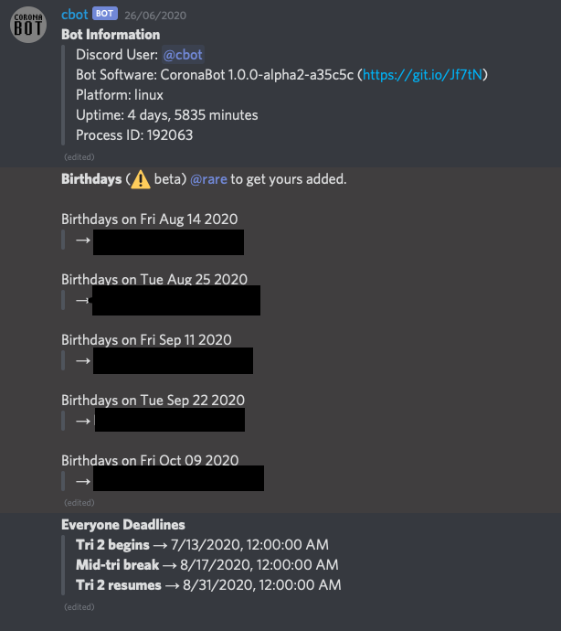
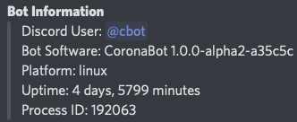

# Summary

Coronabot was originally written in Mar 2020 to supervise the new CoronaClub Discord server while everyone else was huddled up inside during the COVID-19 lockdown. Since the lockdown ended, it's used as a way to procrastinate (like writing the extra as hell document) instead of dealing with the post-lockdown work I have (god help me).

I've written up this guide as the project got a bit too big for me to maintain by myself and having a design document where things are written down is a good idea.

It's split it sections for people to more easily file sections important to them.

* User Guide -- Command reference, user-visible functionality.
* Server Administration -- Command reference, mod-visiable functionality.
* Server Setup -- Setting up the server be compatible with the bot.
* Host Machine Administration -- Keeping the bot online somewhere.
* Developer Guide -- For hacking and maintaining the Coronabot codebase.

# User Guide

This section discusses functionality written for the general users on the target Discord server.


## Dashboard

{width=30%}

The `#dashboard` channel contains glancable information for the day ahead. The information available on it will change from time to time.

At the time of writing, it shows the following items:

* Bot Information - General bot information
* Today's Lectures - Lectures until the end of the day
* Upcoming Deadlines - The next 5 deadlines for each course
* Birthdays - The next 5 birthdays


## Courses

You will be sent a notification whenever there is an upcoming deadline or lecture. Enable notifications for the `#lectures` and `#deadlines` channels.

Lectures for today are available in `#dashboard`.

Ask the server administrators to enrol you in a course role, for example `comp` for COMP261.

For a full listing of courses, deadlines and lectures, see `!courses.list`, `!dl.list` and `!lecture.list` commands.

With no arguments, only a summary is shown.

> Deadline Summary \
> > 420 total deadlines \
> > 0 past deadlines \
> > 420 future deadlines \
>
> Usage: !dl.list [from] [to?] \
> Print the deadlines from index from to index to exclusive.

With one argument, it only shows that one entry, and with two argument, it shows a range of entries.


## Birthdays

Upcoming birthdays are available in `#dashboard`.

You can request your birthday to be added by using the `!bday.request` command.


## Commands

In the `#bots` channel, you can interact with Discord bots, like Coronabot.

The following are commands supported for use:

* `!ping` -- Sends a message to the server and back.
* `!courses.list` -- Lists all the courses.
* `!dl.list` -- Lists all the deadlines.
* `!lecture.list` -- Lists all the lectures.
* `!bday.request` -- Requests a birthday to be added.


# Server Administration

This section discusses functionality written for administrators on the target Discord server.

## Command Summary

## Courses Module

## Birthday Module

## Dashboard Module

## Activity Module (`motd`)

# Server Setup

## Recommended Channel Layout

The following is the recommended channel layout for use with this bot. It is largely based on the channels currently available on CoronaClub.

* `#annoucements` - General Discord server announcement channel
* `#dashboard` - Dashboard channel
* `#lecture` / `#deadlines` - Lecture/deadline warnings channels
* `#birthdays` - Birthday wishes channel
* `#bots` - Bot interaction channel


### Permissions

The simplest way to go about things is to allow the bot administrator rights, but if you'd much rather not, you can try limiting its influence to certain channels. (Have fun debugging it if it doesn't. I'm not gonna do that with the production env.)

The following role permissions are required:

* Read Text Channels & See Voice Channels
* Send Messages
* Manage Messages
* Embed Links
* Attach Files
* Mention @everyone, @here and All Roles


# Host Machine Administration

This section discusses keeping the bot online and managing it on a host machine.


## Installing Coronabot

Coronabot depends on Node.js and npm to run. At the time of writing, Coronabot runs on **Node.js 14.4** and **npm 6.14.5**. Unless massive changes happen to Node.js, there shouldn't be any issues going forward.

It's verified to work on Linux as a target platform, and Windows and macOS as development platforms.

Once those are installed, you can retrieve the project from GitHub and install dependencies.

```bash
$ git clone https://github.com/thegreatrazz/coronabot.git
$ npm install
```


## Configuring Coronabot

Most of the Coronabot configuration is done in `config.json`. An example `config.sample.json` is provided to model your own from, but it is likely severly out of date.

But at the time of writing if follows the following form:

```json
{
    /* path to data folder */
    "dataFolder": "data",

    /* discord connection settings */
    "discord": {
        "token": "## DISCORD TOKEN ##",
    },

    /* dashboard settings */
    "dashboard": {
        "channel": "## CHANNEL ID ##",      // channel where to put dashboard
        "interval": 60000                   // time between dashboard updates
    },

    /* command processor settings */
    "comproc": {
        "prefix": "!",                      // command prefix
        "channel": "690388544228818965",    // the channel to listen to for commands
        "adminRoles": [                     // roles to regard as administrators
            "## ROLE ID ##",
            "## ROLE ID ##"
        ],
        "adminUsers": [                     // users to regard as administrators
            "## USER ID ##",
            "## USER ID ##",
            "## USER ID ##"
        ]
    },

    /* motd settings */
    "motd": {
        "interval": 1800000                 // time between motd updates
    },

    /* courses settings */
    "courses": {
        "defaultRole": "## ROLE ID ##",     // the role to regard as the default role
        "channels": {
            "deadlines": "## CHANNEL ID ##",    // deadline warning channel
            "lectures": "## CHANNEL ID ##"      // lecture warning channel
        }
    },

    /* birthday settings */
    "birthday": {
        "channel": "## CHANNEL ID ##"       // channel to announce birthdays on
    }
}
```

The following items were previously in the schema, but have since been removed or will be removed in a future version:

* Initial Discord channel storage:
  * `discord.announceChannel` $\to$ `birthday.channel`
  * `discord.emailChannel` $\to$ no longer used
  * `discord.botChannel` $\to$ `comproc.channel`

* Legacy course notification system:
  * `classTimes` $\to$ `courses` (different schema)
  * `classTimes.channels` $\to$ `courses.channels` (different schema)
  * `classTimes.channels.lectureTimes` $\to$ `courses.classes.lectures`
  * `classTimes.courses` $\to$ replaced by on-demand data

* Birthday:
  * `birthday.file` -> to be replaced with on-demand data
  * `birthday.refresh` -> no longer used

* Email announcements
  * `imap` -> no longer used
  * `email` -> no longer used


## Starting the Server

After the `config.json` file was created, the bot can be run in standalone mode or daemon mode.


### Standalone Mode

```bash
$ node bin/coronication.js config.json
```

Standalone mode calls the entry point and the bot starts normally, with the log being printed out to `stdout` as per any command-line programs.

To stop the bot, press Ctrl-C.


### Daemon Mode

```bash
# start Coronabot
$ npm start

# stop Coronabot
$ npm stop
```

Daemon mode runs the bot in the background as a UNIX daemon. Output is logged to the `log/` folder instead of `stdout`.

If any issues appear where you're not able to shut the server down with `npm stop`, you can manually do so by looking in `#dashboard` at Bot Information to get the Process ID and using `kill -9`.



```bash
# as an example
$ kill -9 192063
```

# Developer Guide

This section discusses the general layout of the project for modification and maintenance.


# Appendix

## Privacy and Logging Policy

The bot only actively listens on the channels it's been expressly told to interact with.

It only logs commands entered in the `#bots` channel as well as internal messages relating to ensuring everything works properly.
